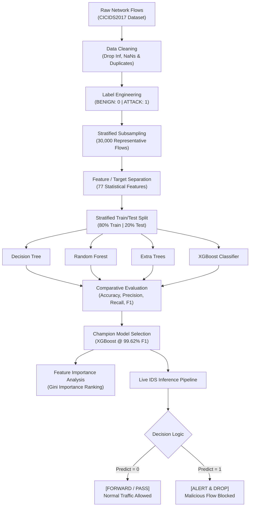
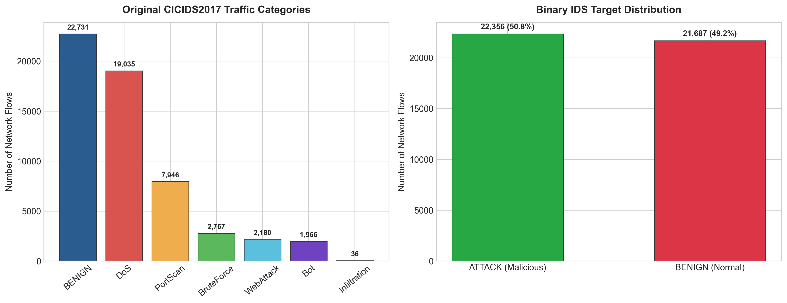
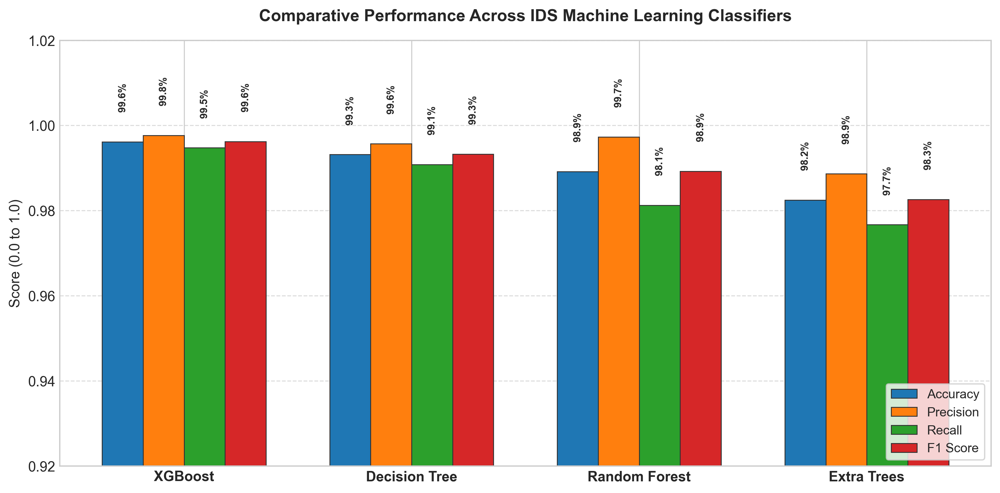
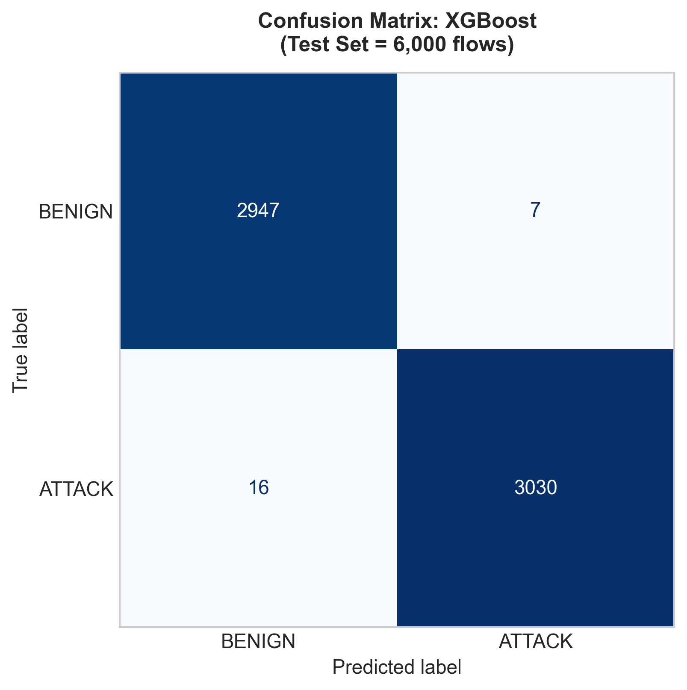
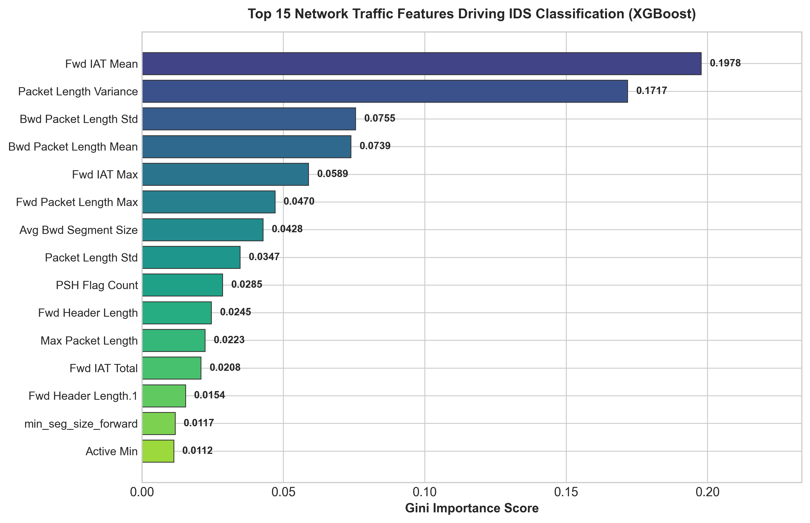
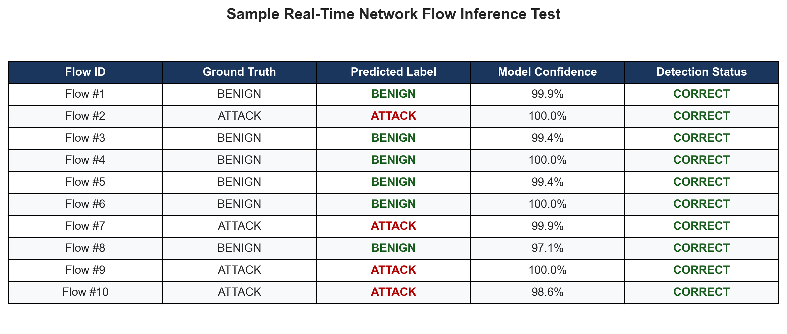

<div align="center">

# 🛡️ Machine Learning-Based Network Intrusion Detection System (NIDS)
### Cryptography & System Security (CSS) — Experiment 10

[](https://www.python.org/)
[](https://scikit-learn.org/)
[](https://xgboost.readthedocs.io/)
[](https://www.unb.ca/cic/datasets/ids-2017.html)
[](#experimental-results--comparative-benchmarking)

---

### 👥 Team Details & Submission Information

| Roll No. | Student Name | Role / Contribution |
| :---: | :--- | :--- |
| **41** | **Maithil Patil** | Model Architecture, Pipeline Design & XGBoost Tuning |
| **43** | **Riddhi Patil** | Data Preprocessing, Cleaning & Feature Engineering |
| **57** | **Priyanka Sharma** | Performance Benchmarking & Metric Evaluation |
| **35** | **Khushi Pandey** | Visualization, Live Simulation & Documentation |

**Course:** Cryptography & System Security (CSS) &nbsp;|&nbsp; **Experiment:** No. 10 &nbsp;|&nbsp; **Academic Year:** 2025–2026

---

</div>

## 📌 Executive Summary

Modern enterprise networks face continuous, sophisticated cyber attacks ranging from Distributed Denial of Service (DDoS) and automated botnets to stealthy brute-force and infiltration campaigns. Traditional **Signature-based Intrusion Detection Systems (SIDS)** rely on static pattern matching (e.g., Snort rules), making them powerless against novel zero-day exploits and polymorphic threats.

This experiment implements an end-to-end **Anomaly-based Network Intrusion Detection System (NIDS)** leveraging **Supervised Machine Learning**. Using flow statistics from the industry-standard **CICIDS2017** benchmark, we train and comparatively evaluate four distinct tree-based ensemble classifiers:
- **XGBoost (Extreme Gradient Boosting)**
- **Random Forest Classifier**
- **Decision Tree (CART)**
- **Extra Trees (Extremely Randomized Trees)**

Our champion model (**XGBoost**) achieves an outstanding **99.62% test accuracy** and **99.62% F1-score**, demonstrating near-zero false positive rates and rapid microsecond inference, making it suitable for real-time automated packet filtering and threat response.

---

## 🎯 Experiment Objectives & Learning Outcomes

1. **Investigate Network Attack Dynamics**: Understand flow-level features (packet lengths, inter-arrival times, flag counters) characterizing attacks such as DoS, Port Scans, Botnets, and Brute Force.
2. **Data Sanitization & Preprocessing**: Clean raw network flow records, handle infinite floating-point values, impute missing entries, remove duplicate traffic, and convert multi-class attacks into binary classification decisions (`BENIGN` vs. `ATTACK`).
3. **Comparative Model Benchmarking**: Evaluate and contrast ensemble algorithms using standard cybersecurity metrics: Accuracy, Precision, Recall, and F1-Score.
4. **Interpret Feature Importance**: Identify the most critical packet headers and statistical flow metrics that distinguish malicious activity from benign network operations.
5. **Simulate Real-Time Inference**: Construct a reusable inference pipeline capable of classifying unseen network flows and triggering automated defensive mitigation (`[FORWARD/PASS]` vs. `[ALERT & DROP]`).

---

## 🏗️ End-to-End System Architecture



---

## 📊 Dataset Analysis & Distribution

The model is evaluated using the **CICIDS2017** benchmark dataset generated by the Canadian Institute for Cybersecurity (CIC). It encompasses realistic background traffic (HTTP, HTTPS, FTP, SSH, Email) combined with diverse cyber-attack profiles executed in a controlled cybersecurity testbed.

### Class Distribution (Raw vs. Engineered Target)

| Category | Raw Count | Classification Target | Target Code |
| :--- | :---: | :---: | :---: |
| **BENIGN (Normal Traffic)** | 22,731 | Benign | `0` |
| **DoS (Denial of Service)** | 19,035 | Malicious Attack | `1` |
| **PortScan** | 7,946 | Malicious Attack | `1` |
| **BruteForce** | 2,767 | Malicious Attack | `1` |
| **WebAttack** | 2,180 | Malicious Attack | `1` |
| **Botnet Traffic** | 1,966 | Malicious Attack | `1` |
| **Infiltration** | 36 | Malicious Attack | `1` |
| **Total Flows** | **56,661** | **Balanced Binary Split** | — |



> **Key Preprocessing Step**: Duplicate flows and infinite mathematical values (resulting from zero-duration flow divisions such as `Flow Bytes/s`) were sanitized. An 80/20 stratified split ensures exact preservation of class ratios across both training and testing partitions.

---

## 🧪 Machine Learning Models Implemented

| Model | Type | Rationale for NIDS | Key Hyperparameters |
| :--- | :--- | :--- | :--- |
| **XGBoost** | Gradient Boosted Trees | Sequentially corrects residual classification errors; highly robust to non-linear flow boundaries. | `n_estimators=120`, `max_depth=8`, `learning_rate=0.1`, `subsample=0.9` |
| **Random Forest** | Bagging Ensemble | Reduces variance by aggregating decorrelated decision trees; handles high-dimensional traffic features. | `n_estimators=120`, `random_state=42`, `n_jobs=-1` |
| **Decision Tree** | Single CART Tree | Provides high interpretability and minimal computational overhead for baseline comparison. | `criterion="gini"`, `max_depth=20` |
| **Extra Trees** | Randomized Forests | Introduces additional randomization during node splitting; extremely fast training on large tabular sets. | `n_estimators=120`, `random_state=42` |

---

## 📈 Experimental Results & Comparative Benchmarking

All four models were trained on 24,000 stratified network flows and evaluated on a holdout test partition of 6,000 unseen network flows.

### Benchmark Performance Summary

| Rank | Model | Test Accuracy | Precision | Recall (Sensitivity) | F1-Score |
| :---: | :--- | :---: | :---: | :---: | :---: |
| 🥇 | **XGBoost** | **99.62%** | **99.77%** | **99.47%** | **99.62%** |
| 🥈 | **Decision Tree** | **99.32%** | **99.57%** | **99.08%** | **99.33%** |
| 🥉 | **Random Forest** | **98.92%** | **99.73%** | **98.13%** | **98.92%** |
| 4 | **Extra Trees** | **98.25%** | **98.87%** | **97.67%** | **98.27%** |



---

## 🔍 In-Depth Champion Model Analysis (XGBoost)

### Detailed Classification Report

```text
              precision    recall  f1-score   support

      BENIGN     0.9946    0.9976    0.9961      2954
      ATTACK     0.9977    0.9947    0.9962      3046

    accuracy                         0.9962      6000
   macro avg     0.9961    0.9962    0.9962      6000
weighted avg     0.9962    0.9962    0.9962      6000
```

### Confusion Matrix Breakdown



- **True Negatives (TN = 2,947)**: Normal benign flows correctly permitted through the firewall.
- **False Positives (FP = 7)**: Normal flows incorrectly flagged as threats (**FPR < 0.24%**), ensuring minimal operational disruption.
- **False Negatives (FN = 16)**: Attacks missed by the model (**FNR < 0.53%**).
- **True Positives (TP = 3,030)**: Malicious attack flows successfully intercepted and dropped.

---

## 🧠 Feature Importance & Cybersecurity Insights

Tree-based feature importance reveals which packet headers and statistical flow metrics are most predictive of intrusion activity:



### Top Critical Flow Signatures

1. **`Fwd IAT Mean` (Forward Inter-Arrival Time Mean)**: Measures the mean time elapsed between consecutive packets sent in the forward direction. High-frequency flooding attacks (e.g., DoS/DDoS) exhibit unnaturally tiny inter-arrival times compared to human browsing.
2. **`Bwd Packet Length Mean` & `Std`**: Characterizes the response packet size distribution. Port scanning and brute force probes yield characteristic tiny or fixed error response payloads.
3. **`Avg Bwd Segment Size`**: Reflects anomalous TCP segment dynamics when an attacker attempts buffer overflows or protocol fuzzing.
4. **`Fwd IAT Total`**: Aggregates the duration of active forward transmission bursts, distinguishing persistent bot communication from standard ephemeral client requests.

---

## 🚀 Live Simulated Intrusion Detection

The trained system includes a real-time detection function that accepts raw network flow records, formats them dynamically, predicts the flow classification with confidence scoring, and triggers mitigation actions:



```python
# Real-time inference function
def detect_intrusion(model, traffic_rows):
    traffic_rows = traffic_rows.reindex(columns=feature_columns, fill_value=0)
    traffic_rows = traffic_rows.apply(pd.to_numeric, errors="coerce").fillna(0)
    predictions = model.predict(traffic_rows)
    return np.where(predictions == 1, "ATTACK", "BENIGN")
```

---

## 💻 How to Run the Experiment

### Option 1: Run in Google Colab (Recommended)
1. Open [Google Colab](https://colab.research.google.com/).
2. Click **Upload** and upload [`ML_Intrusion_Detection_System_Demo.ipynb`](./ML_Intrusion_Detection_System_Demo.ipynb).
3. Select **Runtime > Run all** (`Ctrl + F9`). The notebook automatically fetches the dataset and executes all training, evaluation, and visualization steps.

### Option 2: Run Locally via Jupyter / VS Code
1. Clone this repository:
   ```bash
   git clone https://github.com/Chronos778/css_exp10.git
   cd css_exp10
   ```
2. Install the necessary Python packages:
   ```bash
   pip install -r requirements.txt
   ```
3. Open [`ML_Intrusion_Detection_System_Demo.ipynb`](./ML_Intrusion_Detection_System_Demo.ipynb) in VS Code or JupyterLab:
   ```bash
   jupyter lab ML_Intrusion_Detection_System_Demo.ipynb
   ```
4. Run all cells sequentially.

---

## 📂 Project Repository Structure

```text
css_exp10/
├── assets/                                     # High-resolution experiment graphs & screenshots
│   ├── 01_traffic_distribution.png            # Benign vs Attack class breakdown
│   ├── 02_model_performance_comparison.png    # 4-model accuracy/precision/recall/F1 chart
│   ├── 03_confusion_matrix.png                # XGBoost confusion matrix (TP, FP, TN, FN)
│   ├── 04_feature_importance.png               # Top 15 network traffic features
│   └── 05_inference_sample.png                 # Live inference simulation verification
├── ML_Intrusion_Detection_System_Demo.ipynb    # Interactive Jupyter Notebook experiment
├── requirements.txt                            # Python environment dependencies
├── .gitignore                                  # Git ignore specifications
└── README.md                                   # Comprehensive laboratory submission document
```

---

## 🛡️ Practical Discussion & Real-World Limitations

While our machine learning model achieves **>99.6% accuracy** on benchmark traffic, practical deployment in operational Security Operations Centers (SOCs) presents notable engineering challenges:

1. **Live Packet-to-Flow Extraction Overhead**: The model operates on bidirectional flow statistics (IAT, packet length statistics). Generating these features in real time requires streaming telemetry engines (e.g., **Zeek/Bro**, **Suricata**, or custom **eBPF** hooks in the Linux kernel) before passing data to the model.
2. **Concept Drift & Zero-Day Variants**: Attackers continually modify obfuscation and packet timing to evade ML thresholds. Periodic active retraining and online learning pipelines are essential.
3. **Adversarial Machine Learning**: Sophisticated adversaries may inject packet padding or artificial delays to mimic legitimate flow statistics (adversarial perturbation attacks).
4. **False Positive Operational Cost**: In high-throughput 10 Gbps pipes carrying millions of flows per minute, even a 0.2% false positive rate could trigger thousands of alert fatigue incidents for security analysts. Hybrid deployment combining ML with signature verification provides the best balance.

---

## ❓ Academic Viva-Voce Questions & Answers

<details>
<summary><b>1. What is the difference between a Network IDS (NIDS) and a Host-based IDS (HIDS)?</b></summary>

- **NIDS (Network IDS)**: Placed at strategic choke points (e.g., switches, routers, firewalls) to monitor and analyze traffic passing to and from all devices on the network subnet. It inspects packet headers and flow statistics without consuming endpoint compute resources.
- **HIDS (Host IDS)**: Installed locally on individual endpoints/servers. It monitors system calls, file system modifications, application logs, and local socket activity (e.g., OSSEC, Wazuh).
</details>

<details>
<summary><b>2. Why is F1-score more important than Accuracy in network intrusion detection?</b></summary>

In real-world networks, traffic is heavily imbalanced: legitimate flows often constitute 99% of total packets, while attack traffic represents less than 1%. A naive model predicting "BENIGN" for all flows would achieve 99% accuracy while completely failing to detect attacks. F1-score provides the harmonic mean of Precision and Recall, penalizing both missed attacks (False Negatives) and false alarms (False Positives).
</details>

<details>
<summary><b>3. Why did XGBoost outperform the single Decision Tree?</b></summary>

A single Decision Tree is prone to high variance and overfitting on noisy high-dimensional network data. XGBoost utilizes **Gradient Boosting**, constructing an ensemble of shallow trees sequentially where each successive tree explicitly minimizes the residual errors of prior trees using gradient descent on the loss function, combined with L1/L2 regularization to prevent overfitting.
</details>

<details>
<summary><b>4. What is the role of Flow Inter-Arrival Time (IAT) in detecting DoS attacks?</b></summary>

During normal operations, inter-arrival time between packets varies naturally based on user interaction and server response delays. In automated DoS/DDoS floods (e.g., SYN Flood, UDP Flood), automated scripts emit packets at maximum interface rate, causing `Fwd IAT Mean` and `Fwd IAT Std` to drop drastically toward near-zero values.
</details>

---

## 📚 References & Acknowledgments

- **Dataset**: Canadian Institute for Cybersecurity (CIC), *CICIDS2017 Benchmark Dataset*, University of New Brunswick.
- **Reference Repo**: [Western-OC2-Lab / Intrusion-Detection-System-Using-Machine-Learning](https://github.com/Western-OC2-Lab/Intrusion-Detection-System-Using-Machine-Learning)
- **Scikit-Learn Documentation**: Pedregosa et al., *Scikit-learn: Machine Learning in Python*, JMLR 12, pp. 2825-2830, 2011.
- **XGBoost**: Chen, T., & Guestrin, C. (2016). *XGBoost: A Scalable Tree Boosting System*, ACM SIGKDD.

---

<div align="center">
  <b>Experiment 10 Completed & Validated for CSS Laboratory Submission</b><br>
  Developed with ❤️ by Maithil, Riddhi, Priyanka, and Khushi
</div>
